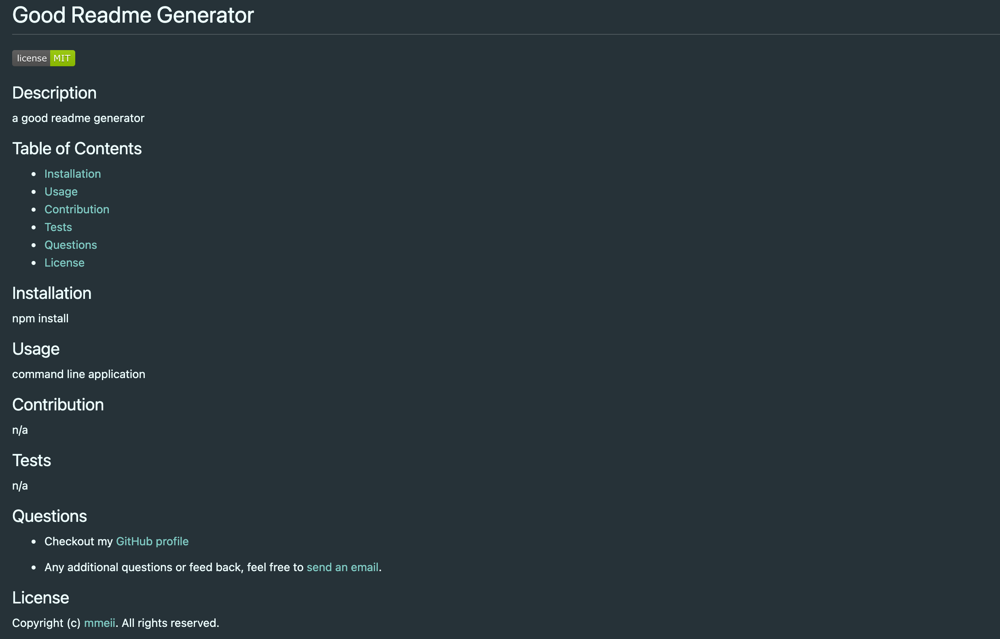

# README Generator

A command-line application that dynamically generates a professionald README.md file from a user's input. Allowing the project creator to devote more time to working on the project.

## Installation

1. Download or clone repository
2. Node.js is required to run the application
3. `npm install` to install the required npm packages

## Usage

* Application will be invoked by using the following command:
  
  `node index.js`

* The user is then prompted to answer questions regarding the README file.
* After all questions are answered, the title of the project and the following sections are generated:
  * Description
  * Table of Contents
    * With clicklable links to the corresponding sections
  * Installation
  * Usage
  * Contributing
  * Tests
  * Questions
    * Link to GitHub profile is added
    * Instruction on how to reach out with additional questions to email
  * License 
    * a badge is added near the top after a license is picked from a list
  
* This is a sample [README](Assets/README.md) file for a project generated using this application
  
  
* [Video Demo](https://drive.google.com/file/d/1cGWd1fgF_1T1bOfJ3wUZ5JSAclSKkKev/view)

## Features

* JavaScript
* Node.js
* npm

## License

  Copyright (c) Mengmei Tu. All rights reserved.
  
  Licensed under the [MIT](LICENSE) license.